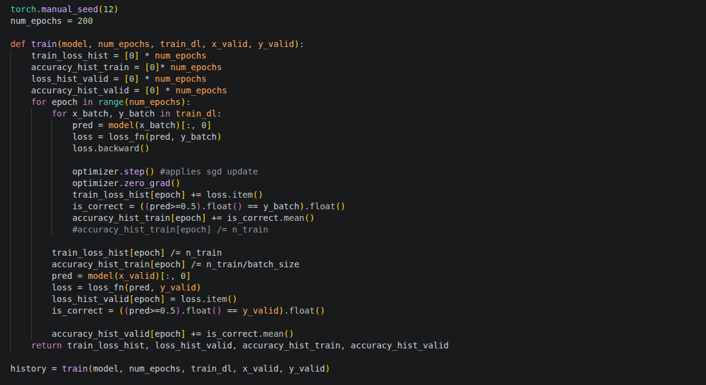
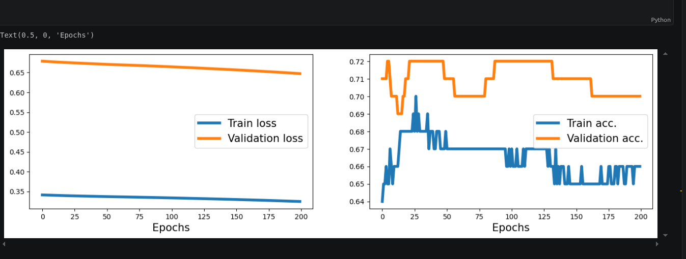
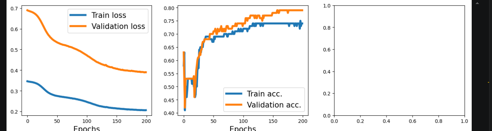
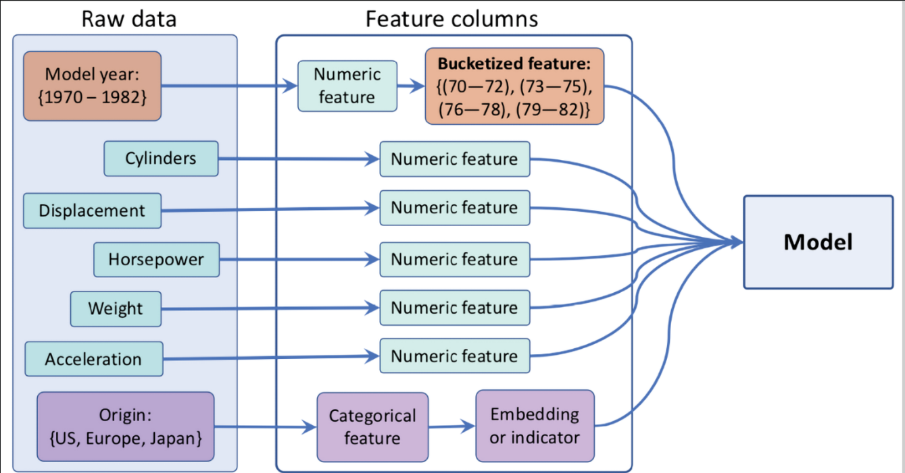
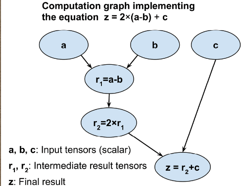

XOR




PREDICTIONG_FUEL:




# GraphLogic — Project Documentation (AI/ML Engineer)

Repository: /home/fadher/CODING/AI_ML_Files/GraphLogic

This document describes the full project, notebooks, code organization, data handling, modelling decisions, training procedures, experiment logs and reproducibility instructions. test.py is intentionally omitted.

---

## Project summary

GraphLogic is a collection of experiments  notebooks focused on:
- PyTorch fundamentals and computational graph mechanics
- Solving the XOR classification problem with custom architectures and layers
- A small applied regression case: predicting fuel efficiency (auto-mpg dataset)
- A PyTorch Lightning example for structured training (MNIST MLP)

The code emphasizes:
- Explicit forward/backward passes and autograd
- Network initialization and weight control
- Custom layer implementation (NoisyLinear)
- Data preprocessing pipelines and feature engineering (bucketization, one-hot encoding)
- Lightweight training loops (vanilla PyTorch) and a LightningModule example for production-ready training

---

## Repository layout (relevant files)

- computational_graph.ipynb — autograd, gradient computation, nn basics, initialization examples
- XOR_classification.ipynb — dataset generation, model experiments, training loop, custom Module and NoisyLinear, decision boundary plotting
- predicting_fuel_inefficiency_project.ipynb — data ingestion (UCI auto-mpg), preprocessing, feature columns, DNN regression training
- pytorch_lightinig.ipynb — PyTorch Lightning MLP and DataModule for MNIST
- README.md — this file
- image assets referenced by notebooks (embedded figures)

---

## Environment & dependencies

Recommended Python environment (Linux):
- Python >= 3.8 (3.9/3.10 recommended)
- Create venv:
  - python3 -m venv .venv
  - source .venv/bin/activate
- Install dependencies:
  - pip install -r requirements.txt

Example requirements (pin versions in production):
```
numpy
pandas
matplotlib
scikit-learn
torch>=1.12
torchvision
pytorch-lightning
torchmetrics
mlxtend
notebook
ipykernel
```

Notes:
- If using CUDA, install the matching torch + torchvision with the appropriate CUDA version.
- Use python-dotenv for environment config if adding secrets (not needed here).

---

## Reproducibility & best practices

- Seeds: notebooks set seeds (torch.manual_seed, numpy.random.seed) — keep seeds consistent across experiments.
- Data splits: use fixed random_state for train/test splits to reproduce results.
- Logging: capture loss/accuracy per epoch; save model checkpoints and optimizer state_dict for exact reproducibility.
- Hardware: document CPU vs GPU runs; GPU will change training timing and nondeterministic cudnn ops can affect exact float results.
- Version control: add `.vscode/`, `.ipynb_checkpoints/`, `.venv/`, and any credentials to `.gitignore`.

---

## Notebooks — detailed notes

### computational_graph.ipynb
Purpose:
- Demonstrate how PyTorch builds computational graphs and computes gradients.

Key elements:
- Simple scalar/compositional function examples to show forward/backward behaviour.
- Use of `requires_grad` to enable autograd.
- Illustration of `loss.backward()` and reading `.grad` on tensors.
- Weight initialization with Xavier (Glorot) initializers using `nn.init.xavier_*`.

Takeaways:
- Manual construction of a forward pass and explicit backward call is useful for debugging gradient flows.
- Proper initialization influences early training dynamics.

Suggested experiments:
- Compare xavier_normal_ vs xavier_uniform_ and observe gradient magnitudes.
- Visualize gradient norms per-parameter during training.

---

### XOR_classification.ipynb
Purpose:
- Solve XOR classification as a canonical test of non-linear model capacity.

Data pipeline:
- Generate N=200 samples uniformly in [-1,1]^2.
- Labels: y = 1 if x0 * x1 >= 0 else 0.
- Split: first 100 samples used for training, remainder for validation (not ideal — prefer random split; keep seed).

Model implementations:
- Baseline sequential MLP: Linear(2,4)->ReLU->Linear(4,4)->ReLU->Linear(4,1)->Sigmoid
- Custom Module (`MyModule`) built from ModuleList for flexibility.
- Custom layer `NoisyLinear`:
  - Adds Gaussian noise to inputs during training (controlled by noise_stddev).
  - Uses `nn.Parameter` for weights and biases and Xavier initialization.
  - Used to regularize and explore stochastic perturbations.

Training loop:
- Loss: Binary Cross Entropy (`nn.BCELoss`).
- Optimizer: SGD (lr variable; experiments use 0.001–0.015).
- Batch size: small (2) to simulate SGD updates.
- Epochs: 200 in experiments.
- Metrics: epoch-wise train/validation loss and accuracy; decision boundary plotted using mlxtend.

Implementation considerations & issues observed:
- Original split used the first 100 points as train — prefer random split with fixed seed for robust validation.
- Small batch size increases noise in gradients; useful in toy experiments but unstable for real problems.
- Using `Sigmoid` + `BCELoss` requires stable logits — consider `BCEWithLogitsLoss` with raw logits to improve stability.

Suggested improvements:
- Replace final Sigmoid + BCELoss with raw logits + BCEWithLogitsLoss.
- Use DataLoader for both train and validation datasets with proper shuffle and deterministic split.
- Experiment with different hidden sizes and depth to measure capacity vs overfitting.

---

### predicting_fuel_inefficiency_project.ipynb
Purpose:
- Regression task predicting MPG using the UCI auto-mpg dataset.

Data ingestion & cleaning:
- Source: http://archive.ics.uci.edu/ml/machine-learning-databases/auto-mpg/auto-mpg.data
- Column names: ['MPG','Cylinders','Displacement','Horsepower','Weight','Acceleration','Model Year','Origin']
- Handling missing values: `na_values="?"` then `dropna()`.
- Train/test split: scikit-learn `train_test_split(test_size=0.2, random_state=2)`.

Feature engineering:
- Numerical columns normalized using training statistics (mean/std) — applied to both train and test using train stats (correct).
- Bucketize Model Year: boundaries [73,76,79] using `torch.bucketize`, then treat as numeric bucket feature.
- One-hot encode Origin (categorical) using `torch.nn.functional.one_hot`.
- Final features concatenated: normalized numeric columns + one-hot origin vector.

Model architecture:
- DNN regressor constructed programmatically from `hidden_units = [8, 4]`:
  - Flatten-like structure for tabular input: Linear(input_size, 8) -> ReLU -> Linear(8, 4) -> ReLU -> Linear(4,1)
- Loss: MSE (`nn.MSELoss`) for regression.
- Optimizer: SGD (lr=0.001 used); experiments log per-epoch average training loss.

Training loop specifics:
- Batch size: 8.
- Epochs: 200 (print loss every 20 epochs).
- Training uses `loss.backward()` then `optimizer.step()` and `optimizer.zero_grad()`.

Practical notes & suggestions:
- Standardize target variable (MPG) optionally for numerical stability, or use relative error metrics (MAE, RMSE).
- Use validation split and save best model based on validation loss; current script prints training loss only.
- Consider Adam optimizer (better default), learning rate schedules, weight decay.
- Evaluate model on test set at the end with RMSE and MAE; produce residual plots to inspect bias.
- If horsepower contains missing values (sometimes as '?'), ensure robust imputation (median or KNN).

---

### pytorch_lightinig.ipynb
Purpose:
- Demonstrate a production-style training module with PyTorch Lightning (PL) and a DataModule for MNIST.

Key components:
- `MultiLayerPerceptron` (pl.LightningModule):
  - Configurable hidden_units; flatten input; final linear output for 10 classes.
  - Uses `torchmetrics.Accuracy` for train/valid/test metrics.
  - Implements `training_step`, `validation_step`, `test_step`, and `configure_optimizers`.
- `MnistDataModule` (pl.LightningDataModule):
  - Downloads MNIST, creates train/val/test split and DataLoaders.

Advantages:
- PL abstracts training loop, checkpointing and logging.
- Clear separation of model and data pipeline; easier to scale experiments, enable distributed training, and integrate callbacks (EarlyStopping, ModelCheckpoint).

Suggestions:
- Use `BCEWithLogitsLoss` only for binary; for multi-class use `CrossEntropyLoss` with raw logits (no Sigmoid/Softmax).
- Log metrics via `self.log(..., on_epoch=True, prog_bar=True)` for consistent tracking.
- Add callbacks for early stopping and checkpointing by monitoring validation loss/accuracy.

---

## Experiment logs & results (brief)

- XOR experiments: using a small MLP with two hidden layers and ReLU achieved training/validation accuracy patterns shown in notebook plots. NoisyLinear introduced stochasticity that can regularize training.
- Fuel efficiency: DNN with hidden units [8,4] trained with SGD produced convergent training losses (noted in notebook prints). Further tuning recommended for test RMSE and feature engineering.
- Lightning MNIST: PL module architecture and DataModule are functional; recommended hyperparameter sweep (hidden sizes, lr, optimizer type) and early stopping.

---

## Recommended scripts & developer workflow

1. Setup:
   - python3 -m venv .venv
   - source .venv/bin/activate
   - pip install -r requirements.txt

2. Running notebooks:
   - Launch Jupyter:
     - jupyter lab
   - Or convert notebooks to scripts for CLI runs:
     - jupyter nbconvert --to script XOR_classification.ipynb

3. Save best models:
   - In training loops, add:
     - torch.save(model.state_dict(), "models/model_epochXX.pth")
     - Save optimizer state for exact resume.

4. Add experiment tracking:
   - Integrate Weights & Biases / TensorBoard for organized hyperparameter sweeps and artifact tracking.

---

## Short checklist before productionizing

- [ ] Replace any hard-coded credentials (none included here).
- [ ] Ensure deterministic splits and seed settings are documented.
- [ ] Add evaluation notebooks with test metrics and calibration/residual analysis.
- [ ] Add unit tests for custom layers (NoisyLinear output shapes, parameter registration).
- [ ] Add a Dockerfile or environment.yml for reproducible compute environment.

---

## Security & hygiene

- Do not commit API keys or ngrok URLs.
- Add `.env` to `.gitignore` if using env vars for local tunnels or secrets.
- Rotate any keys that may have been exposed earlier.

---

## Next steps / research ideas

- For XOR: explore Bayesian neural nets, dropout, and deeper nets to study capacity vs regularization.
- For auto-mpg: feature interactions, polynomial features, tree-based models (XGBoost) for baseline comparison, SHAP explanations for feature importance.
- For Lightning: enable multi-GPU training, mixed precision, learning rate finder and schedulers.

---


